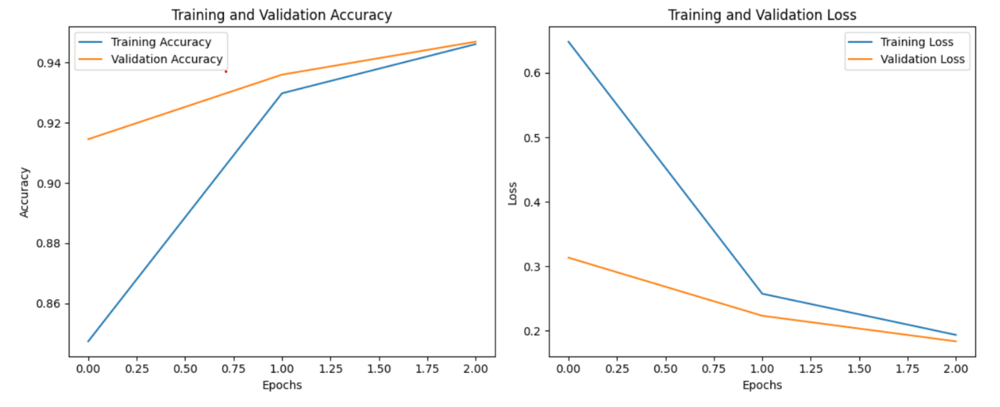

# Designing and Implementing a User-Friendly Plant Disease Classification System in the AWS Ecosystem: Insights and Practical Approaches

## Abstract
In this project, an end-to-end system for classifying various plant diseases using Amazon Web Services (AWS) has been developed. This system allows users to upload images of plants through a web interface, which are then processed and analyzed using a machine learning model deployed on AWS SageMaker. The classification results, along with confidence scores, are saved in Amazon DynamoDB.

## Introduction
The main goal of this project is to design a user-friendly web platform where users can upload plant images and receive automated disease classification. This system utilizes AWS to support the creation, deployment, and scaling of machine learning applications.

## AI Ecosystem Architecture Used
The plant disease classification application utilizes various AWS components to create a comprehensive and scalable architecture. Key components include:

- **Web Interface (EC2 Instance):** Hosts the Flask-based web application.
- **Image Storage (S3):** Stores uploaded plant images securely in an S3 bucket.
- **Image Preprocessing (EC2 - Flask Application):** Adjusts image sizes before classification.
- **Model Inference (SageMaker Endpoint):** Analyzes images using a deployed machine learning model.
- **Result Storage (DynamoDB):** Stores classification results with unique identifiers for retrieval.

## Model Description
The model employed is based on the Xception architecture, known for its efficiency in image classification tasks. This model was trained using the Plant Village dataset and demonstrates high accuracy.

## Performance Results
The system achieved a validation accuracy of 95% after three epochs of training.

## Confusion Matrix

## Scalability Considerations
The system's scalability is supported by AWS services, ensuring it can handle increased demands:

- **Data Storage Scalability (S3):** Handles growing amounts of image data.
- **Compute Scalability (EC2 Auto Scaling):** Manages varying compute needs.
- **Model Inference Scalability (SageMaker):** Supports high volumes of inference requests.
- **Database Scalability (DynamoDB):** Scales horizontally to manage increased traffic and data.

## Conclusion
The project demonstrates the potential of AWS in deploying and scaling machine learning applications efficiently, providing a robust solution for plant disease classification that can be extended to other domains.

## References
- AWS Documentation on various services like S3, SageMaker, and DynamoDB.
- Chollet, F. (2017). Xception: Deep Learning with Depthwise Separable Convolutions.

